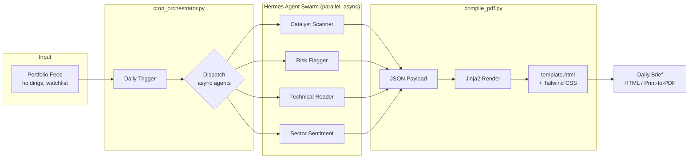
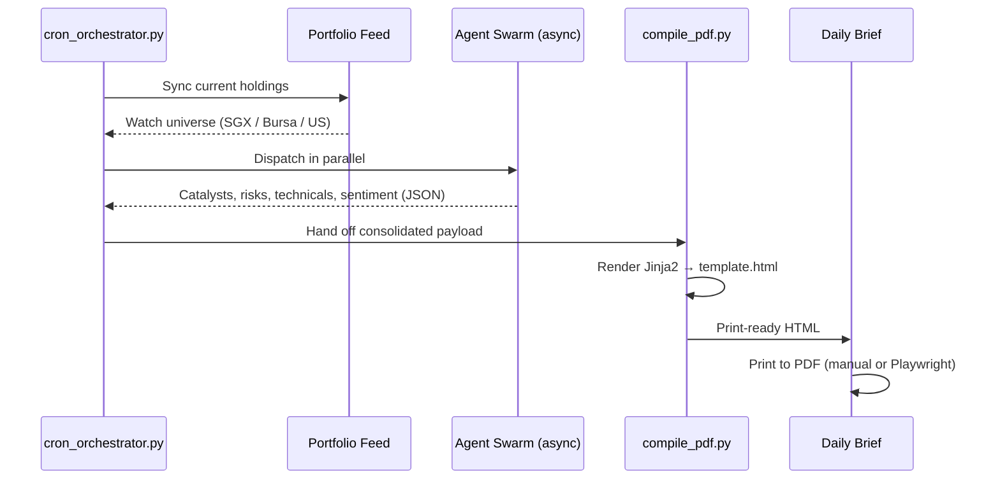

# Hermes Financial Intelligence Pipeline

> Automated, high-velocity research-to-print workflow for the modern quantitative trader.

Hermes ingests raw financial market data from multi-agent research swarms and compiles it into a professionally typeset, actionable daily briefing document — replacing dashboard "information overload" with a clean, F-pattern editorial layout built for rapid cognitive processing and high-conviction decisions.

---

## 🚀 Core Philosophy

**Speed to Intelligence.** In a volatile market, scrolling through news feeds is a tax on your cognitive capital. Hermes transforms raw data into a structured newspaper format built on three rules:

| Principle | What it means |
|---|---|
| **Actionability** | Every data point must link to a trade, a risk, or a sector shift — or it doesn't get surfaced. |
| **Visual Efficiency** | Classic editorial grid systems maximize reading speed over dashboard sprawl. |
| **Zero-Noise** | If no agent flagged it as a catalyst or risk, it never reaches the page. |
| **Regional Relevance** | Coverage universe is SGX + Bursa Malaysia + US equities — not a generic global feed. |

---

## 🏗️ System Architecture



---

## 🏛️ Tech Stack

| Layer | Technology | Role |
|---|---|---|
| Orchestration | Python + `cron_orchestrator.py` | Daily-cadence trigger, fires parallel async sub-agents |
| Model Layer | Free-tier LLM agents | One agent per research domain, kept cost-efficient at daily cadence |
| Data Layer | JSON payloads | Dynamic portfolio injection — tickers read from holdings, never hardcoded |
| Rendering | HTML5 + Tailwind CSS | Editorial grid layout |
| Templating | Jinja2 | Binds JSON payload to `template.html` |
| Compilation | `compile_pdf.py` | Bridges agent output → static template → print-ready HTML |
| Typography | Google Fonts | Playfair Display, Cinzel, JetBrains Mono |

---

## 📂 Project Structure

```
hermes/
├── soul.md                    # Identity & behavioral spec: tone, output discipline, signal-vs-noise rules
├── cron_orchestrator.py       # Scheduling layer, fires the daily agent swarm
├── agents/
│   ├── catalyst_scanner.py
│   ├── risk_flagger.py
│   ├── technical_reader.py
│   └── sector_sentiment.py
├── compile_pdf.py             # Loads JSON payload, renders template, outputs ready-to-print HTML
├── template.html              # Master editorial template (CSS, Tailwind config, Jinja2 placeholders)
├── sample_hermes_output.json  # Example agent payload (sample portfolio: NVDA, PLTR, SOFI, AAPL, MSFT, NFLX, NOW, VOO, M14.SI, D05.SI)
└── README.md                  # You are here
```

---

## ⚙️ Workflow



1. **Portfolio Sync** — orchestrator reads current holdings, builds the day's watch universe (no hardcoded ticker list).
2. **Ingestion** — parallel async sub-agents scan market data, sentiment, and technicals across that universe, each outputting a valid JSON payload.
3. **Compilation** — run the compiler to bind agent output to the visual template:

   ```bash
   python compile_pdf.py
   ```

4. **Consumption** — open the resulting HTML to read the brief, or print directly to PDF for a physical daily dossier.

---

## 🛠️ Customization

**Editing the layout** — `template.html` is pure Tailwind; adjust grid density, typography scale, or color palette by editing classes directly.

**Extending agent data** — to add a new field (e.g. a "Sector Sentiment" score):
1. Update `compile_pdf.py` to handle the new JSON key.
2. Add the matching Jinja2 placeholder (`{{ new_data_key }}`) to `template.html`.

**Adjusting portfolio scope** — ticker coverage is injected dynamically. Update the source portfolio feed; the next orchestrator run picks it up automatically, no template edits needed.

---

## 📋 Roadmap

| Status | Item | Notes |
|---|---|---|
| ⬜ | Automated PDF rendering | Integrate `Playwright` into `compile_pdf.py` to save rendered HTML as high-res PDF |
| ⬜ | Real-time API hook | Connect compiler to a live data endpoint for intraday updates |
| ⬜ | Theme variants | Dark Mode + tablet-optimized CSS profile |
| ⬜ | Institutional report mode | Longer-form institutional-style PDF alongside the daily brief |
| ⬜ | Feedback loop | Log whether flagged catalysts/risks actually moved tickers, to tune agent signal quality over time |
---

*Built for the individual who treats market intelligence as an asset. Manage your input, manage your risk.*
